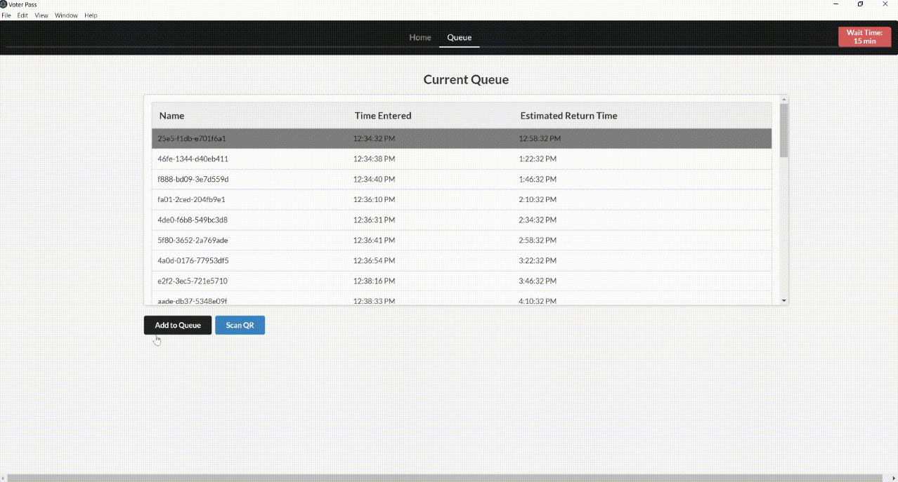

# Voter Pass


Voter Pass is a desktop application designed to simplify and enhance the voting process by implementing a queue system. It reduces the tedious hours of standing in line by providing voters with a return ticket that indicates when they should return to the polling station. The application is built using Electron.js, Node.js, PouchDB, and Semantic UI.

## Features

- **Offline First:** Voter Pass is an offline-first application, meaning it stores data locally on the device's cache using PouchDB. When an internet connection is available, the data is automatically synchronized with the cloud.
- **Anonymous Return Tickets:** Each voter receives an anonymous return ticket containing a return timestamp and a scannable QR code. This ensures the privacy of voters while providing an efficient queue management system.
- **QR Code Scanner:** The application includes a built-in QR code scanner, allowing attendants to easily scan and process return tickets.
- **Seamless Queue Management:** Adding voters to the queue is a seamless process facilitated by a single button. Attendents can also modify the wait time if needed.
- **Ticket Expiration:** Return tickets automatically expire after 30 minutes from the assigned return time, freeing up local cache resources.

## Tech Stack
- Electron.js: A framework for building cross-platform desktop applications using web technologies.
- PouchDB: A NoSQL database that enables offline data storage and synchronization.
- Semantic UI: A modern CSS framework for creating visually appealing and responsive user interfaces.

## Installation
To run the Voter Pass application locally, follow these steps:

1. Clone the repository:

```bash
  git clone https://github.com/navidali/voterpass.git
```

2. Install the dependencies:

```bash
  cd voterpass
  npm install
```

3. Start the application:

```bash
  npm start
```
